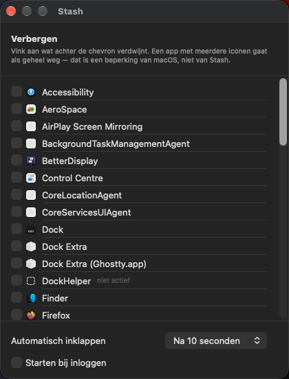

# Stash

Stash hides macOS menu bar icons behind a single arrow, so a crowded bar collapses to
one click. It targets **macOS 27**, the release that broke this whole category of app at once. Some
of them have since come back: Bartender (Golden Gate beta), Thaw (2.0) and Brow all
rebuilt on the new architecture. Ice, Hidden Bar, Barbee, Sane Bar and Glow are still
broken. Ice is the one measured here — it is what I ran until it stopped working, and the
log evidence below is Ice's.

Stash is the open source option next to those: the same job, nothing to buy, nothing to
sign in to, and the research it is built on is in this repository.

<p>
  
</p>

*Collapsed: only the arrow and a handful of apps are visible. Click it and the rest
reappear; click again and they're gone.*

## Why the existing tools stopped working

Until macOS 26, the system drew every status item as its own window. That was never a
public API, but it gave the whole category something to hold on to: you could enumerate
those windows through `CGWindowList`, capture them with ScreenCaptureKit, and push them
off screen.

macOS 27 draws the menu bar as **one window**. There is nothing left to enumerate. Two
further changes make the classic workarounds fail outright:

- An `NSStatusItem` whose backing window reaches **half the screen width** is *dropped*
  from the layout instead of being clamped. The old trick — inflate a spacer item until
  everything to its left falls off screen — no longer pushes anything anywhere. Measured
  by others on a 1728pt display: 848pt hides, 849pt does not (848 + 16pt of chrome = 864
  = 1728/2). That figure is not mine; the single-window rewrite and the log line below are.
- The new engine has a notion of *supported* status items and refuses the rest. Straight
  out of `MenuBarAgent` on the machine this was built on:

  ```
  [com.apple.menubar:statusItems] Filtering out unsupported status item: com.jordanbaird.Ice
  ```

  34 times in a single minute. The spacer items are actively filtered out of the bar
  they are trying to control.

None of this was a bug in Ice, Bartender or any of the others. It was a rewrite that
removed the implementation detail their entire category depended on, with no public
replacement for it. The apps that work again did not patch around it — they were rebuilt
on something else, which is what this repository is about too.

macOS 27 does ship its own overflow button (`•••`), but it decides for itself what
collapses. There is no supported way to choose per app what gets hidden.

## How Stash works instead

macOS 27 still contains the facility behind **assessment mode** — the exam mode schools
use to strip a Mac's menu bar bare during a test. It behaves as an **allowlist**: you
hold an assertion listing which apps may draw a status item, and the system simply does
not draw the rest.

That facility lives in a private framework, `MenuBarClientCore`, behind two undocumented
classes: `MBAssessmentModeConfiguration` and `MBAssessmentModeAssertion`. Stash `dlopen`s
the framework, builds a configuration listing the apps that should stay visible, and
activates an assertion with it. Collapsing and expanding is nothing more than replacing
that assertion with one carrying a different allowlist. Quitting Stash invalidates it,
which hands every icon straight back.

This is a private API, not a stable contract. If Apple changes or removes it,
`STMenuBarShim.isAvailable` returns false: the arrow renders as a warning triangle, the
toggle does nothing, and no apps get hidden. It does not crash, and it does not touch
anything else on the system.

Read [`docs/superpowers/specs/2026-09-22-stash-design.md`](docs/superpowers/specs/2026-09-22-stash-design.md)
for the full reasoning, the probe output it is based on, and the pitfalls (an `NSSet`
where the API demands an `NSArray` throws; an `allowedSystemItems` range of `0...63`
silently kills Screen Mirroring). The task-by-task implementation plan lives in
[`docs/superpowers/plans/2026-09-22-stash.md`](docs/superpowers/plans/2026-09-22-stash.md).
Both documents are written in Dutch.

## Architecture

| Layer | Responsibility |
|---|---|
| `MenuBarShim` (Objective-C) | wraps the private `MenuBarClientCore` framework via `dlopen` + runtime lookup |
| `StashCore` (Swift) | pure logic: app inventory − hidden set → allowlist; persistence; assertion lifecycle |
| `Stash` (AppKit + SwiftUI) | arrow status item, settings window, accessory app |

Swift 6.4, SwiftPM, no Xcode project.

<p>
  
</p>

*Expanded: the arrow flips and everything comes back.*

## Limitations

These are limits of the underlying facility, not choices Stash made:

- **Per app, not per icon.** An app that puts up several status items goes as a whole;
  there is no way to hide just one of them.
- **No reordering.** The allowlist controls whether something is drawn, not where.
- **No second bar or panel showing the hidden icons.** The technique that made that kind
  of UI possible — enumerating and repositioning each item's own window — doesn't exist
  on macOS 27.
- **Private framework.** Any macOS update can break Stash, and an app built on this can
  never ship on the Mac App Store. That is a deliberate trade-off: the supported
  alternative is having no control over the menu bar at all.

## Install

```
git clone https://github.com/brentc22/stash.git
cd stash
make install
open /Applications/Stash.app
```

`make install` builds a release binary, bundles it, ad-hoc code-signs it, and copies it
to `/Applications`.

**The `/Applications` location is a real requirement, not a suggestion.** Stash keeps its
own arrow visible only when it runs as the copy of `com.brentc22.Stash` that
LaunchServices resolves for that bundle identifier — in practice, the one in
`/Applications`. Run the binary from anywhere else and everything else still works — the
arrow reacts to clicks, other apps' icons hide and come back — but the system never
draws Stash's own icon, so there is nothing left to click.

## Requirements

- macOS 27.
- Xcode Command Line Tools with Swift 6.4. Xcode itself is not required and not used.
- **`swift test` does not work here — use `swift run StashTests`.** Running `swift test`
  prints `error: no tests found; create a target in the 'Tests' directory`, because there
  deliberately is no such target. On a Command-Line-Tools-only machine both XCTest and
  swift-testing fail to build or link: they need pieces that ship only inside Xcode. So
  the suite is a plain executable target instead, and exit code 0 means every test
  passed.

## Building and testing

```
swift build             # debug build
swift run StashTests    # run the test suite (exit 0 = green)
make build              # release build
make bundle             # release build + Stash.app, ad-hoc signed
make install            # bundle + stop a running instance + copy to /Applications
make run                # make install, then open the /Applications copy
make test               # swift run StashTests
make clean              # remove .build and Stash.app
Resources/make-icon.sh  # regenerate Resources/Stash.icns
```

Two things about the plain `swift build` / `swift run` binary: it has no app bundle, so
its own arrow never renders (see Install, above), and with no bundle identifier
`UserDefaults.standard` writes to a different domain than the installed app reads, so
settings made there don't show up in the real one. Use `make install` when you want to
see the real thing running.

Run the test suite with Stash **not** running. The tests read the menu bar's own log to
verify what actually changed, and a second Stash holding its own assertion makes two of
those measurements ambiguous.

## Settings

Right-click the arrow for "Settings…": a checklist of every app Stash
has seen running (apps not running right now are marked *not running*), an auto-collapse
delay, and a "Launch at login" toggle backed by `SMAppService`.

<p>
  
</p>

## Uninstall

- **Turn off "Launch at login" in Settings before quitting**, if it was on. That
  unregisters the `SMAppService` login item cleanly; quitting first without doing this
  leaves the login item registered, so macOS keeps launching Stash at login even after
  the app itself is gone.
- **Quit Stash** — right-click the arrow and choose "Quit Stash". This lifts the
  assessment-mode assertion and hands every hidden icon back before the app disappears.
- **Remove the app**: `rm -rf /Applications/Stash.app`.
- **Remove its saved settings**: `rm -f ~/Library/Preferences/com.brentc22.Stash.plist`.
  This is the hidden-apps list and the auto-collapse delay; only needed for a full clean.

## License

MIT — see [LICENSE](LICENSE).

## Contributing

This has been built and tested on exactly one Mac, on one build of macOS 27.0 (26A428).
If you hit different behaviour — a different `LSMinimumSystemVersion` cutoff, a Mac where
the private framework isn't present, a build where the allowlist behaves differently — an
issue with your macOS build number and what you saw is the most useful thing you can send.
